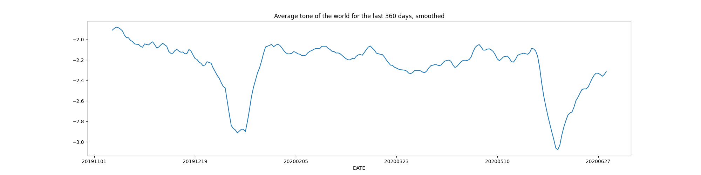

## News Sentiment Analysis
A brief look at the sentiment data of news around the world, the playbook is ran on 03/01/2024 (that is January 3rd for the Americans out there). Uses the open source GDELT dataset for the acquisition and sentiment analysis.

The first part analyzes which countries had the most/least news on the date. Which of them had the highest/lowest average news tone (sentiment), along with their visualizations.

The second part takes a look at the average tone of news over every day in 2023. This let's us identify major world events like Israeli-Palestinian conflict and earthquakes in Turkiye and Syria. Then I focus on Turkish news to see if they get lower sentiment due to the earthquake (which turns out to be a wrong hypothesis by the graphs below). Then we look at the Covid-19 period, which let's us clearly see the major outbreak events by the fall in sentiment. 

And finally I look at a slight tangent to see if S&P500 has any relationships with sentiment analysis, but due to highly uncorrelated graphs (as perhaps expected) I don't pursure this.

## Followup
I would like to further investigate the trens of the news sentiment and even make an app with it, however, the way I access the dataset is way too slow right now and each year is around 2.5TB of data (so no chance of storing locally). The main problem stems from pulling the data using "SELECT * FROM table" due to the implementation of GDELT library and then processing everything in python, being able to query the database directly would make the operations much faster. GDELT is expected to release a tool to more efficently access the data in 2024, will wait until then.

## Plots
First, we look at the distribution of news published on the internet on a daily basis:

We can also see a similar situation on the world map

Now, we can look at the sentiments accross the world on 03/01/2024

The plots of average sentiments across the world and Turkey (the x-axis can be shown better, should be understandable nonetheless)

And finally news sentiment during Covid-19

